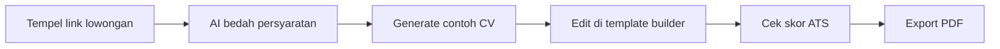

# LolosCV 📄✅

**Bangun CV yang lolos filter ATS dan enak dibaca rekruter, gratis, langsung dari browser.**

Sebagian besar CV gugur sebelum dibaca manusia karena tidak cocok dengan kata kunci lowongan. LolosCV membalik alurnya: mulai dari lowongan impianmu, biarkan AI membedah persyaratannya, lalu susun CV yang menjawab tepat kebutuhan itu, dalam Bahasa Indonesia atau Inggris.

## ⚙️ Alur kerja

## ✨ Fitur

| Fitur | Detail |
|---|---|
| 🧱 Template builder | 4 template (ATS Classic, ATS + Foto, Creative, Modern Minimal), urutan section bisa digeser, section bisa disembunyikan |
| 🌐 Dua bahasa | Seluruh CV dan label section tersedia dalam Indonesia dan Inggris, sekali klik |
| 🧩 Section fleksibel | Pengalaman profesional, organisasi, proyek pilihan, pendidikan dengan skripsi dan riset multi-bullet, skill berkelompok sesuai kategorimu, penghargaan dan sertifikasi |
| 🔍 Job analyzer | Tempel URL lowongan (LinkedIn, JobStreet, Glints, situs perusahaan) atau paste teksnya untuk ekstraksi persyaratan dan skor ATS |
| 📥 Import CV lama | Upload PDF, datanya diekstrak otomatis dan siap dilanjutkan |
| 🖨️ Export PDF | Mode 1 halaman (dipadatkan otomatis) atau 2 halaman, hasil unduhan sama persis dengan pratinjau |
| 🔑 BYOK AI | Pakai API key milikmu sendiri (OpenAI, Anthropic, DeepSeek, Gemini, Groq, dan lainnya), tersimpan hanya di browser |
| 🏆 Leaderboard donatur | Terupdate otomatis dari Saweria |

## 🖨️ Template

| Template | Cocok untuk |
|---|---|
| ATS Classic | Lamaran korporat dan BUMN, satu kolom hitam putih yang ramah mesin ATS |
| ATS + Foto | Butuh pas foto 2x3 tanpa mengorbankan keterbacaan ATS |
| Creative | Portofolio dan peran kreatif, blok warna plus tag skill |
| Modern Minimal | Tampilan timeline yang bersih untuk startup dan teknologi |

## 🤝 Masukan dan saran

LolosCV dikembangkan oleh PogungSoftwareHouseTeam (PSHT), dan saranmu sangat berarti untuk arah pengembangannya. Punya ide fitur atau menemukan bug? Buka *issue*; ingin bantu kode? Kirim *pull request*, semua kontribusi disambut.

## ☕ Dukung pengembangan

Gratis selamanya, dikembangkan independen. Kalau terbantu, traktir lewat Saweria dan namamu otomatis tampil di leaderboard:

**[Donasi via Saweria](https://saweria.co/pogungsoftwarehouse)**

## 📄 Lisensi

Hak cipta dilindungi undang-undang © 2026 PogungSoftwareHouseTeam (PSHT). Lihat [LICENSE](LICENSE). Masukan dan kontribusi via *issue*/*pull request* tetap dipersilakan.
